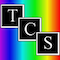

<!--

  

  

-->

- I am a freelance iOS developer.  As an indepedent programmer, I have developed apps from design to deployment, but also have been added as an additional resource to existing teams.  I can work in either environment.
- I'm available to collaborate on open-source iOS projects.
- I've worked with a variety of languages and systems.  Currently, I work in native iOS using Swift and SwiftUI.  
- Prior to iOS, I was a database developer for 20+ years, primarily working with manufacturing systems (MRP/ERP).

<h3 align="left">Languages and Tools:</h3>

      

<h3 align="left">Some of the apps I've worked on:</h3>

       
 
  
  

*All logos belong to the respective companies
     
<!--

-->
